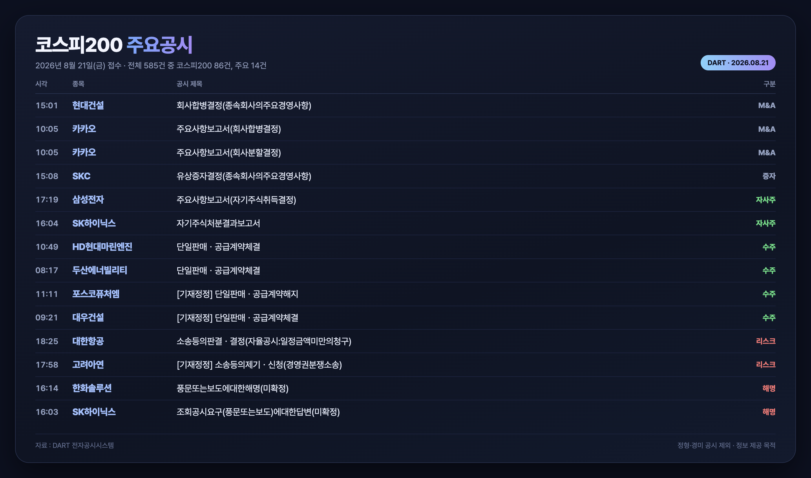

# 코스피200 주요공시 봇

매 영업일 오전 6시(KST)에 **직전 영업일 코스피200 종목의 주요공시**를 카드 이미지로 만들어
Threads에 `주식` 주제로 자동 게시합니다. GitHub Actions에서 돌기 때문에 PC를 켜둘 필요가 없습니다.



## 동작 방식

```
직전 거래일 판정 (삼성전자 일봉에 캔들이 있는 날 = 거래일)
        ↓
코스피200 구성종목 수집 (네이버 금융)
        ↓
DART 전체공시 수집 (대상 날짜 전부)
        ↓
회사명 매칭 → 화이트리스트로 주요공시만 선별 → 중요도 정렬
        ↓
카드 PNG 렌더 (Playwright) + 본문 생성
        ↓
카드를 docs/cards/ 에 커밋 (raw URL 생성)
        ↓
Threads API로 게시 (topic_tag=주식)
```

### 왜 두 단계로 나눠져 있나

Threads API는 **로컬 파일 업로드를 지원하지 않고 공개 URL만 받습니다.** Meta 서버가 그 URL로
이미지를 가져가는 방식이라, 게시 전에 카드를 먼저 리포지토리에 커밋해서 raw URL을 만들어야 합니다.
그래서 `build` → 커밋 → `post` 순서입니다.

## 실행

```bash
npm install
npx playwright install --with-deps chromium

node index.js build   # 수집 → 선별 → 카드 렌더 → out/post.json
node index.js post    # Threads 게시 (DRY_RUN=true 면 출력만)
```

수동 확인은 Actions 탭에서 `코스피200 주요공시 게시` 워크플로를 `Run workflow`로 실행하고
`dry_run`을 체크하면 됩니다. 게시 없이 카드만 아티팩트로 받아볼 수 있습니다.

## 필요한 Secrets

| 이름 | 설명 |
| --- | --- |
| `THREADS_USER_ID` | Threads 사용자 ID (숫자) |
| `THREADS_ACCESS_TOKEN` | 장기 액세스 토큰 (60일 유효, 자동 갱신됨) |
| `GH_PAT` | 토큰 갱신 워크플로가 위 Secret을 덮어쓰기 위한 GitHub 토큰. fine-grained PAT, 이 리포에 `Secrets: read and write` 권한만 있으면 됩니다 |

### 토큰 발급 (최초 1회)

1. [Meta 개발자 콘솔](https://developers.facebook.com/apps)에서 앱 생성 → **Threads 사용 사례** 추가
2. `앱 역할 > 역할`에서 본인 계정을 **Threads 테스터**로 추가하고, Threads 앱의
   `설정 > 웹사이트 권한`에서 초대 수락
3. 인증창에서 `threads_basic`, `threads_content_publish` 권한으로 로그인 → 인증 코드 획득
4. 인증 코드 → 단기 토큰 → `grant_type=th_exchange_token`으로 장기 토큰(60일) 교환
5. 장기 토큰과 사용자 ID를 Secrets에 저장

본인 계정만 게시하는 용도라면 **App Review는 필요 없습니다.**

### 토큰 갱신

`Threads 토큰 갱신` 워크플로가 매주 토요일에 `refresh_access_token`을 호출해
새 토큰을 `THREADS_ACCESS_TOKEN` Secret에 덮어씁니다. 장기 토큰은 60일 만료인데
**만료 알림이 없기 때문에** 이 워크플로가 죽으면 어느 날 갑자기 게시가 실패합니다.
실패 알림을 켜두는 걸 권합니다.

## 선별 기준

`src/select.js`의 화이트리스트에 걸리는 공시만 채택합니다. 블랙리스트 방식으로는
매번 새로운 정형 공시가 섞여 들어와 품질이 흔들려서 화이트리스트로 갔습니다.

중요도 순서: 실적 → 배당 → M&A → 증자 → 자사주 → 수주 → 리스크 → 지배구조 →
투자 → 지분 → 사채 → 해명 → 주요사항보고서 → 자율공시

여기 걸려도 뉴스성이 낮은 것(채무보증, 정기보고서, 특수관계인 거래, 증권신고서 등)은
`DROP`에서 다시 걸러냅니다.

기준을 바꾸고 싶으면 `PRIORITY`와 `DROP` 배열만 손보면 됩니다.

## 알아둘 점

- **실행 시각은 정확하지 않습니다.** GitHub Actions의 스케줄은 최소 5분 간격이고,
  정시에는 부하가 몰려 수십 분 밀리는 일이 흔합니다. 6시가 6시 30분이 될 수 있습니다.
- **리포에 활동이 없으면 스케줄 워크플로가 비활성화됩니다.** 매일 카드를 커밋하므로
  정상 동작 중에는 문제되지 않습니다.
- 카드 PNG는 `docs/cards/`에 계속 쌓입니다. 공개 리포이므로 이미지도 공개됩니다.
- 카드 이미지 폭은 1440px을 넘으면 안 됩니다(Threads 사양). 현재 1400px CSS + 1x 배율입니다.
- 휴장일이거나 주요공시가 0건이면 게시하지 않고 조용히 종료합니다.

## 데이터 출처

- 코스피200 구성종목, 일봉: 네이버 금융 (응답이 `euc-kr`이라 디코딩 필요)
- 공시: [DART 전자공시시스템](https://dart.fss.or.kr) 전체공시 목록 (API 키 불필요)

정보 제공 목적이며 투자 판단의 책임은 본인에게 있습니다.
